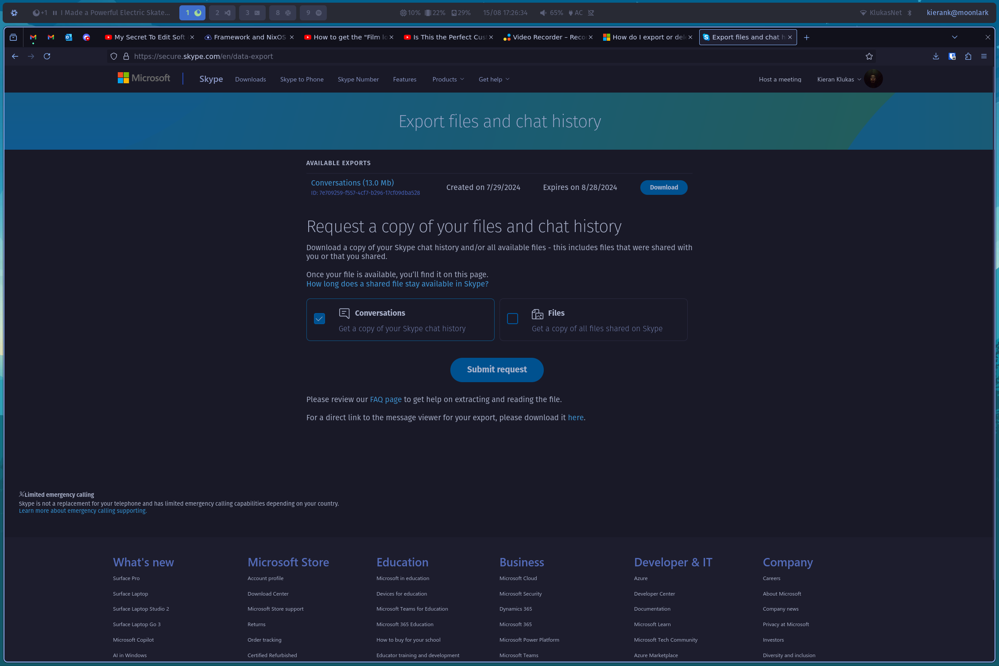

# Mini Me!

A project to make a mini you with openai 4-o

A demo of the cli and how to use it can be found here [on youtube](https://youtu.be/3RDaxo5k854)

## Steps

1. Get your skype data from [the skype data export page](https://secure.skype.com/en/data-export)

2. extract the `.tar` file it gives you and stick the json files you get into the `data` directory of this project